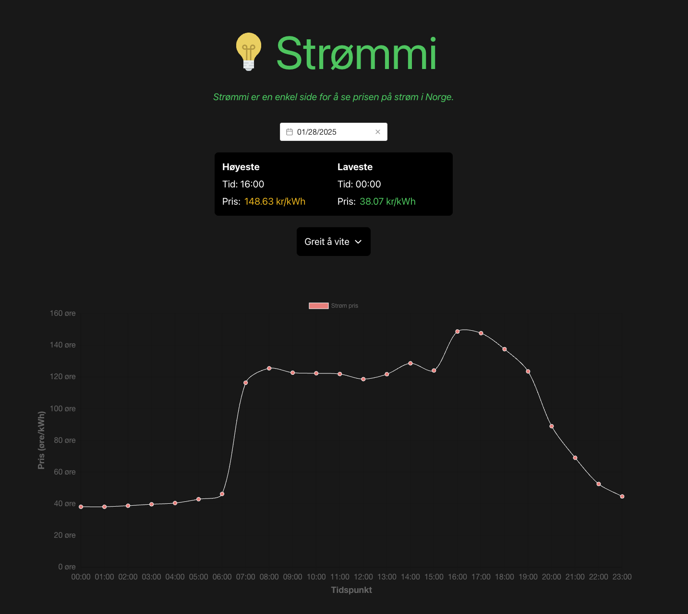

# Strømmi

Strømmi er en enkel side for å se prisen på strøm i Norge.



## Features
- View electricity prices by date
- Interactive chart showing price variations
- Color-coded price indicators
- Responsive design

## Tech Stack
- Vue 3
- TypeScript
- Tailwind CSS
- Chart.js
- Vue Query

## Development

```sh
npm install
npm run dev
```

Åpne [http://localhost:5173](http://localhost:5173) i nettleseren for å se applikasjonen kjøre.


## Se appen live

Applikasjonen er enkelt hostet hos Netlify [strommi.netlify.app](https://strommi.netlify.app).
